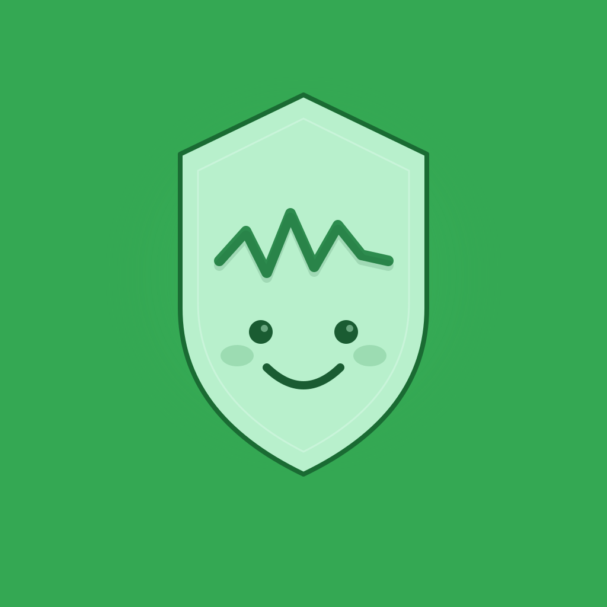

<p align="center">
  
</p>

<h1 align="center">GluWink</h1>

<p align="center"><strong>Make your iPhone and Apple Watch a tool for diabetes — not a distraction from it.</strong></p>

GluWink shields the apps on your phone until you've checked in on your glucose. Glucose and carbs everywhere — Home Screen, Lock Screen, StandBy, every Apple Watch face. A friendly green face when things look good, a red one when something needs your attention. Other apps stay blocked until you've done the diabetes thing.

It's open source. Your data stays on your device (HealthKit) or on the Nightscout site you control. No accounts, no servers we run, no analytics, no ads.

## What it does

1. **Glucose and carbs visible everywhere.** Widgets in every size for Home Screen, Lock Screen and StandBy. Complications on every watch face. An optional glucose number on the app icon badge.
2. **Clear status at a glance.** Green = looks good. Red = needs attention (high/low glucose, stale sensor, missing carb entry). Same simple language across the app, widgets, and watch.

   <p>
     
     &nbsp;
     
   </p>
3. **Optional app blocking.** Block other apps at configurable intervals — always, or only when something needs your attention. When blocking is on and the face is red, GluWink locks other apps until you check in. Otherwise, your phone is just your phone.

## Who it's for

**Parents of children with Type 1.** Set up once on the child's iPhone via Family Sharing. Pick which apps stay free to use (the CGM app, school apps, phone, messages). A passphrase only the parent knows protects the settings. The child can't delete the app or skip the check-in.

**Adults managing their own Type 1.** Authorize GluWink for yourself — no Family Sharing required. Have a partner, spouse, or friend set the passphrase. The friction is the point. You can always uninstall — GluWink is honest about that. It nudges, it doesn't imprison.

## Where data comes from

**Apple Health.** Most CGM apps (Dexcom, Libre, CamAPS, xDrip, Loop, iAPS, and others) already write glucose and carbs to Apple Health. If yours does, GluWink is a one-tap connection.

**Nightscout.** Connect a Nightscout site instead — handy when a parent monitors a child remotely, or when your diabetes system writes to Nightscout but not Apple Health. Both sources can be on at the same time; the most recent reading wins.

**Demo mode.** Want to try the app without a sensor? Demo mode shows realistic glucose and carb data.

## What it isn't

GluWink is **not a medical device.** It does not replace your CGM, your pump, your endocrinologist, or your judgment. It does not make treatment decisions. It surfaces information that's already on the phone and asks one question: did you do the diabetes thing yet?

## Install

GluWink targets the App Store. Until that's published, build it yourself — see [`CONTRIBUTING.md`](./CONTRIBUTING.md) for the iOS setup walkthrough.

Requirements:

- macOS with Xcode 15+
- A physical iPhone (Screen Time APIs don't work in the Simulator)
- An Apple Developer account (free or paid) for code signing
- A CGM that writes to Apple Health, **or** a Nightscout site, **or** Demo mode

## How it works

GluWink is built on Apple's [Screen Time](https://developer.apple.com/documentation/familycontrols) and [Managed Settings](https://developer.apple.com/documentation/managedsettings) frameworks. The main iPhone app reads glucose and carbs from Apple Health (or fetches from Nightscout), writes a snapshot into a shared App Group, and a Shield Configuration extension renders the check-in UI on top of every non-excluded app. A Device Activity Monitor extension re-arms the shields on a schedule. The Apple Watch app reads HealthKit on the watch directly so it stays useful when the phone is out of reach.

For the architecture deep-dive — targets, data flow, App Group keys, Screen Time API patterns, security model — read [`AGENTS.md`](./AGENTS.md). For platform quirks and hard-won lessons, read [`QUIRKS.md`](./QUIRKS.md).

## Project layout

```
GluWink/
├── iOS/                  Xcode project (7 targets: app, watch, widgets, shield extensions)
│   ├── App/              Main iPhone app
│   ├── WatchApp/         watchOS app + complications
│   ├── StatusWidget/     Home/Lock/StandBy widgets
│   ├── ShieldConfig/     Shield Configuration extension (renders the check-in UI)
│   ├── ShieldAction/     Shield Action extension (handles button taps)
│   ├── DeviceActivityMonitor/ Re-arms shields on a schedule
│   ├── SharedKit/        Shared Swift package
│   └── fastlane/         App Store metadata pipeline
├── AppStore/             Editorial source of truth for the App Store listing
├── AGENTS.md             Architecture, data flow, security model, conventions
├── QUIRKS.md             Platform quirks and gotchas (read before changing things)
├── CONTRIBUTING.md       How to build, test, and contribute
├── Makefile              Build, install, screenshot, App Store push
└── LICENSE               PolyForm Noncommercial 1.0.0 + addendum
```

## Contributing

Bug fixes and small improvements are welcome as PRs. For new features, architectural changes, or ports to other platforms (Android, Wear OS, etc.), open an issue first so we can align on approach.

See [`CONTRIBUTING.md`](./CONTRIBUTING.md) for the full setup, project structure, coding conventions, testing notes, and the things you can and can't do safely.

## License

GluWink is released under the **PolyForm Noncommercial License 1.0.0** with an addendum that reserves public app-store distribution to the maintainers — see [`LICENSE`](./LICENSE) for the full text.

In short:

- **You may** read and modify the code, contribute back (including ports to other platforms), build it for your own devices, and share builds with private testers under your own developer account (TestFlight, Ad-Hoc, Enterprise, Play closed/internal tracks, sideloading, and equivalents).
- **You may not** sell the app or any derivative, or publish it for general public availability — under this name or any other — to the Apple App Store, Google Play, or any other public marketplace.

If you'd like to do something the license doesn't allow, [open an issue](https://github.com/FokkeZB/GluWink/issues) — exceptions can be granted in writing.

---

*Type 1 diabetes is relentless. The phone doesn't have to be.*
